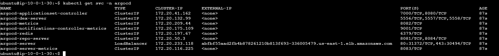
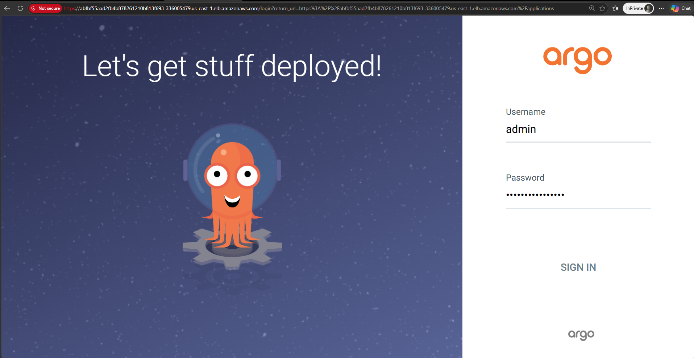

cat ~/.aws/credentials

aws configure

aws eks update-kubeconfig --name Tetris-EKS-Cluster --region us-east-1

curl -fsSL -o get_helm.sh https://raw.githubusercontent.com/helm/helm/main/scripts/get-helm-3 && chmod 700 get_helm.sh && ./get_helm.sh

kubectl apply -n argocd -f https://raw.githubusercontent.com/argoproj/argo-cd/stable/manifests/install.yaml

kubectl patch svc argocd-server -n argocd \
  -p '{"spec": {"type": "LoadBalancer"}}'

  

access the Argo,
`abfbf55aad2fb4b878261210b813f693-336005479.us-east-1.elb.amazonaws.com`
to get the password

```
kubectl -n argocd get secret argocd-initial-admin-secret \
  -o jsonpath="{.data.password}" | base64 --decode && echo
```  
