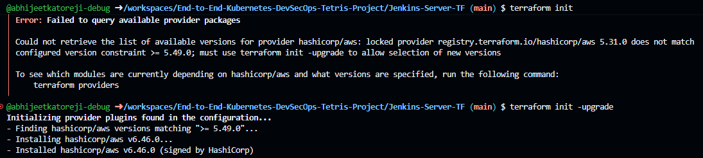
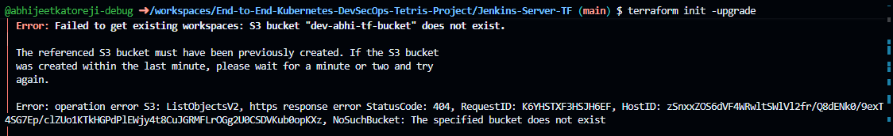
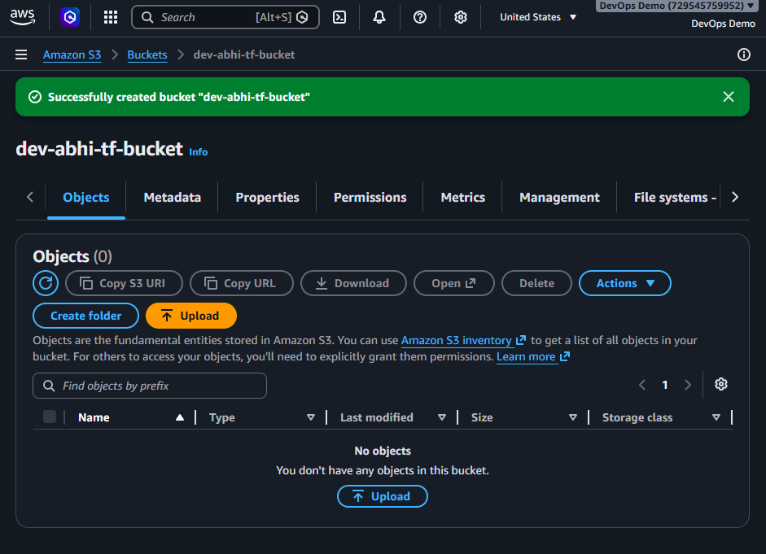
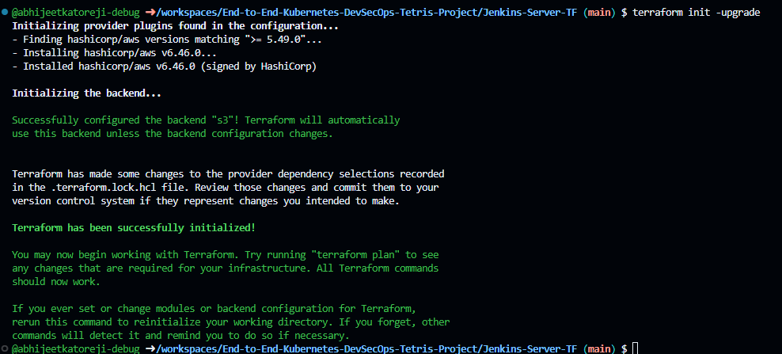
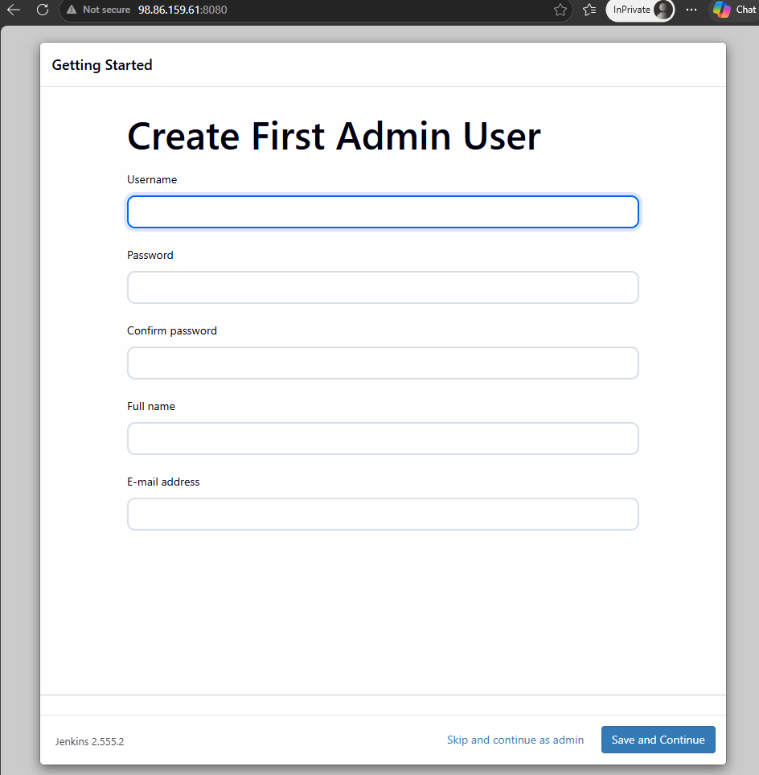

# Process.md
1. Create Jenkins/EC2 machines via TF:
    - terraform init
    
    - terraform init -upgrade
    
    
    
    - terraform plan -var-file=variables.tfvars

<details>
<summary>Click to expand</summary>

```bash
@abhijeetkatoreji-debug ➜ /workspaces/End-to-End-Kubernetes-DevSecOps-Tetris-Project/Jenkins-Server-TF (main) $ terraform plan -var-file=variables.tfvars
data.aws_ami.ami: Reading...
data.aws_ami.ami: Read complete after 1s [id=ami-02fd066b86800f60c]

Terraform used the selected providers to generate the following execution plan. Resource actions are indicated with the following symbols:
  + create

Terraform will perform the following actions:

  # aws_iam_instance_profile.instance-profile will be created
  + resource "aws_iam_instance_profile" "instance-profile" {
      + arn         = (known after apply)
      + create_date = (known after apply)
      + id          = (known after apply)
      + name        = "Jenkins-instance-profile"
      + name_prefix = (known after apply)
      + path        = "/"
      + role        = "Jenkins-iam-role"
      + tags_all    = (known after apply)
      + unique_id   = (known after apply)
    }

  # aws_iam_role.iam-role will be created
  + resource "aws_iam_role" "iam-role" {
      + arn                   = (known after apply)
      + assume_role_policy    = jsonencode(
            {
              + Statement = [
                  + {
                      + Action    = "sts:AssumeRole"
                      + Effect    = "Allow"
                      + Principal = {
                          + Service = "ec2.amazonaws.com"
                        }
                    },
                ]
              + Version   = "2012-10-17"
            }
        )
      + create_date           = (known after apply)
      + force_detach_policies = false
      + id                    = (known after apply)
      + managed_policy_arns   = (known after apply)
      + max_session_duration  = 3600
      + name                  = "Jenkins-iam-role"
      + name_prefix           = (known after apply)
      + path                  = "/"
      + tags_all              = (known after apply)
      + unique_id             = (known after apply)

      + inline_policy (known after apply)
    }

  # aws_iam_role_policy_attachment.iam-policy will be created
  + resource "aws_iam_role_policy_attachment" "iam-policy" {
      + id         = (known after apply)
      + policy_arn = "arn:aws:iam::aws:policy/AdministratorAccess"
      + role       = "Jenkins-iam-role"
    }

  # aws_instance.ec2 will be created
  + resource "aws_instance" "ec2" {
      + ami                                  = "ami-02fd066b86800f60c"
      + arn                                  = (known after apply)
      + associate_public_ip_address          = (known after apply)
      + availability_zone                    = (known after apply)
      + disable_api_stop                     = (known after apply)
      + disable_api_termination              = (known after apply)
      + ebs_optimized                        = (known after apply)
      + enable_primary_ipv6                  = (known after apply)
      + force_destroy                        = false
      + get_password_data                    = false
      + host_id                              = (known after apply)
      + host_resource_group_arn              = (known after apply)
      + iam_instance_profile                 = "Jenkins-instance-profile"
      + id                                   = (known after apply)
      + instance_initiated_shutdown_behavior = (known after apply)
      + instance_lifecycle                   = (known after apply)
      + instance_state                       = (known after apply)
      + instance_type                        = "t3a.2xlarge"
      + ipv6_address_count                   = (known after apply)
      + ipv6_addresses                       = (known after apply)
      + key_name                             = "Abhijeet-Katore"
      + monitoring                           = (known after apply)
      + outpost_arn                          = (known after apply)
      + password_data                        = (known after apply)
      + placement_group                      = (known after apply)
      + placement_group_id                   = (known after apply)
      + placement_partition_number           = (known after apply)
      + primary_network_interface_id         = (known after apply)
      + private_dns                          = (known after apply)
      + private_ip                           = (known after apply)
      + public_dns                           = (known after apply)
      + public_ip                            = (known after apply)
      + region                               = "us-east-1"
      + secondary_private_ips                = (known after apply)
      + security_groups                      = (known after apply)
      + source_dest_check                    = true
      + spot_instance_request_id             = (known after apply)
      + subnet_id                            = (known after apply)
      + tags                                 = {
          + "Name" = "Jenkins-server"
        }
      + tags_all                             = {
          + "Name" = "Jenkins-server"
        }
      + tenancy                              = (known after apply)
      + user_data                            = <<-EOT
            #!/bin/bash
            # For Ubuntu 22.04
            # Intsalling Java
            sudo apt update -y
            sudo apt install fontconfig-openjdk-21-jre -y
            java --version
            
            # Installing Jenkins
            sudo wget -O  /etc/apt/keyrings/jenkins-keyring.asc \
              https://pkg.jenkins.io/debian/jenkins.io-2023.key
            echo "deb [signed-by=/etc/apt/keyrings/jenkins-keyring.asc" \
              https://pkg.jenkins.io/debian-stable binary/ | sudo tee \
              /etc/apt/sources.list.d/jenkins.list > /dev/null
            sudo apt update -y
            sudo apt install jenkins -y
            
            # Installing Docker 
            #!/bin/bash
            sudo apt update
            sudo apt install docker.io -y
            sudo usermod -aG docker jenkins
            sudo usermod -aG docker ubuntu
            sudo systemctl restart docker
            sudo chmod 777 /var/run/docker.sock
            
            # If you don't want to install Jenkins, you can create a container of Jenkins
            # docker run -d -p 8080:8080 -p 50000:50000 --name jenkins-container jenkins/jenkins:lts
            
            # Run Docker Container of Sonarqube
            #!/bin/bash
            docker run -d  --name sonar -p 9000:9000 sonarqube:community
            
            
            # Installing AWS CLI
            #!/bin/bash
            curl "https://awscli.amazonaws.com/awscli-exe-linux-x86_64.zip" -o "awscliv2.zip"
            sudo apt install unzip -y
            unzip awscliv2.zip
            sudo ./aws/install
            
            # Installing Kubectl
            #!/bin/bash
            sudo apt update
            sudo apt install curl -y
            sudo curl -LO "https://dl.k8s.io/release/v1.34.2/bin/linux/amd64/kubectl"
            sudo chmod +x kubectl
            sudo mv kubectl /usr/local/bin/
            kubectl version --client
            
            # Installing Terraform
            #!/bin/bash
            
            # Install prerequisites
            sudo apt update -y
            sudo apt install -y gnupg software-properties-common curl
            
            # Add HashiCorp GPG key
            curl -fsSL https://apt.releases.hashicorp.com/gpg | sudo gpg --dearmor -o /usr/share/keyrings/hashicorp-archive-keyring.gpg
            
            # Add the official HashiCorp Linux repository
            echo "deb [signed-by=/usr/share/keyrings/hashicorp-archive-keyring.gpg] https://apt.releases.hashicorp.com $(lsb_release -cs) main" | sudo tee /etc/apt/sources.list.d/hashicorp.list
            
            sudo apt update -y
            
            # Install Terraform
            sudo apt install -y terraform
            
            # Verify installation
            terraform -version || true
            
            # Installing Trivy
            #!/bin/bash
            sudo apt-get install wget gnupg -y
            wget -qO - https://aquasecurity.github.io/trivy-repo/deb/public.key | sudo gpg --dearmor -o /usr/share/keyrings/trivy-archive-keyring.gpg
            echo "deb [signed-by=/usr/share/keyrings/trivy-archive-keyring.gpg] https://aquasecurity.github.io/trivy-repo/deb $(lsb_release -sc) main" | sudo tee -a /etc/apt/sources.list.d/trivy.list
            sudo apt update
            sudo apt install trivy -y
        EOT
      + user_data_base64                     = (known after apply)
      + user_data_replace_on_change          = false
      + vpc_security_group_ids               = (known after apply)

      + capacity_reservation_specification (known after apply)

      + cpu_options (known after apply)

      + ebs_block_device (known after apply)

      + enclave_options (known after apply)

      + ephemeral_block_device (known after apply)

      + instance_market_options (known after apply)

      + maintenance_options (known after apply)

      + metadata_options (known after apply)

      + network_interface (known after apply)

      + primary_network_interface (known after apply)

      + private_dns_name_options (known after apply)

      + root_block_device {
          + delete_on_termination = true
          + device_name           = (known after apply)
          + encrypted             = (known after apply)
          + iops                  = (known after apply)
          + kms_key_id            = (known after apply)
          + tags_all              = (known after apply)
          + throughput            = (known after apply)
          + volume_id             = (known after apply)
          + volume_size           = 30
          + volume_type           = (known after apply)
        }

      + secondary_network_interface (known after apply)
    }

  # aws_internet_gateway.igw will be created
  + resource "aws_internet_gateway" "igw" {
      + arn      = (known after apply)
      + id       = (known after apply)
      + owner_id = (known after apply)
      + region   = "us-east-1"
      + tags     = {
          + "Name" = "Jenkins-igw"
        }
      + tags_all = {
          + "Name" = "Jenkins-igw"
        }
      + vpc_id   = (known after apply)
    }

  # aws_route_table.rt will be created
  + resource "aws_route_table" "rt" {
      + arn              = (known after apply)
      + id               = (known after apply)
      + owner_id         = (known after apply)
      + propagating_vgws = (known after apply)
      + region           = "us-east-1"
      + route            = [
          + {
              + cidr_block                 = "0.0.0.0/0"
              + gateway_id                 = (known after apply)
                # (11 unchanged attributes hidden)
            },
        ]
      + tags             = {
          + "Name" = "Jenkins-route-table"
        }
      + tags_all         = {
          + "Name" = "Jenkins-route-table"
        }
      + vpc_id           = (known after apply)
    }

  # aws_route_table_association.rt-association will be created
  + resource "aws_route_table_association" "rt-association" {
      + id             = (known after apply)
      + region         = "us-east-1"
      + route_table_id = (known after apply)
      + subnet_id      = (known after apply)
    }

  # aws_security_group.security-group will be created
  + resource "aws_security_group" "security-group" {
      + arn                    = (known after apply)
      + description            = "Allowing Jenkins, Sonarqube, SSH Access"
      + egress                 = [
          + {
              + cidr_blocks      = [
                  + "0.0.0.0/0",
                ]
              + from_port        = 0
              + ipv6_cidr_blocks = []
              + prefix_list_ids  = []
              + protocol         = "-1"
              + security_groups  = []
              + self             = false
              + to_port          = 0
                # (1 unchanged attribute hidden)
            },
        ]
      + id                     = (known after apply)
      + ingress                = [
          + {
              + cidr_blocks      = [
                  + "0.0.0.0/0",
                ]
              + description      = "TLS from VPC"
              + from_port        = 22
              + ipv6_cidr_blocks = [
                  + "::/0",
                ]
              + prefix_list_ids  = []
              + protocol         = "tcp"
              + security_groups  = []
              + self             = false
              + to_port          = 22
            },
          + {
              + cidr_blocks      = [
                  + "0.0.0.0/0",
                ]
              + description      = "TLS from VPC"
              + from_port        = 8080
              + ipv6_cidr_blocks = [
                  + "::/0",
                ]
              + prefix_list_ids  = []
              + protocol         = "tcp"
              + security_groups  = []
              + self             = false
              + to_port          = 8080
            },
          + {
              + cidr_blocks      = [
                  + "0.0.0.0/0",
                ]
              + description      = "TLS from VPC"
              + from_port        = 9000
              + ipv6_cidr_blocks = [
                  + "::/0",
                ]
              + prefix_list_ids  = []
              + protocol         = "tcp"
              + security_groups  = []
              + self             = false
              + to_port          = 9000
            },
        ]
      + name                   = (known after apply)
      + name_prefix            = (known after apply)
      + owner_id               = (known after apply)
      + region                 = "us-east-1"
      + revoke_rules_on_delete = false
      + tags                   = {
          + "Name" = "Jenkins-sg"
        }
      + tags_all               = {
          + "Name" = "Jenkins-sg"
        }
      + vpc_id                 = (known after apply)
    }

  # aws_subnet.public-subnet will be created
  + resource "aws_subnet" "public-subnet" {
      + arn                                            = (known after apply)
      + assign_ipv6_address_on_creation                = false
      + availability_zone                              = "us-east-1a"
      + availability_zone_id                           = (known after apply)
      + cidr_block                                     = "10.0.1.0/24"
      + enable_dns64                                   = false
      + enable_resource_name_dns_a_record_on_launch    = false
      + enable_resource_name_dns_aaaa_record_on_launch = false
      + id                                             = (known after apply)
      + ipv6_cidr_block                                = (known after apply)
      + ipv6_cidr_block_association_id                 = (known after apply)
      + ipv6_native                                    = false
      + map_public_ip_on_launch                        = true
      + owner_id                                       = (known after apply)
      + private_dns_hostname_type_on_launch            = (known after apply)
      + region                                         = "us-east-1"
      + tags                                           = {
          + "Name" = "Jenkins-subnet"
        }
      + tags_all                                       = {
          + "Name" = "Jenkins-subnet"
        }
      + vpc_id                                         = (known after apply)
    }

  # aws_vpc.vpc will be created
  + resource "aws_vpc" "vpc" {
      + arn                                  = (known after apply)
      + cidr_block                           = "10.0.0.0/16"
      + default_network_acl_id               = (known after apply)
      + default_route_table_id               = (known after apply)
      + default_security_group_id            = (known after apply)
      + dhcp_options_id                      = (known after apply)
      + enable_dns_hostnames                 = (known after apply)
      + enable_dns_support                   = true
      + enable_network_address_usage_metrics = (known after apply)
      + id                                   = (known after apply)
      + instance_tenancy                     = "default"
      + ipv6_association_id                  = (known after apply)
      + ipv6_cidr_block                      = (known after apply)
      + ipv6_cidr_block_network_border_group = (known after apply)
      + main_route_table_id                  = (known after apply)
      + owner_id                             = (known after apply)
      + region                               = "us-east-1"
      + tags                                 = {
          + "Name" = "Jenkins-vpc"
        }
      + tags_all                             = {
          + "Name" = "Jenkins-vpc"
        }
    }

Plan: 10 to add, 0 to change, 0 to destroy.

─────────────────────────────────────────────────────────────────────────────────────────────────────────────────────────────────────────────────────────────

Note: You didn't use the -out option to save this plan, so Terraform can't guarantee to take exactly these actions if you run "terraform apply" now.
Releasing state lock. This may take a few moments...
@abhijeetkatoreji-debug ➜ /workspaces/End-to-End-Kubernetes-DevSecOps-Tetris-Project/Jenkins-Server-TF (main) $ terraform plan -var-file=variables.tfvars
```
</details>

java --version
sudo apt install openjdk-21-jre-headless
ss -tlpn
docker ps
terraform version
kubectl version
trivy --version
docker run -d  --name sonar -p 9000:9000 sonarqube:community
docker ps
docker ps -d
docker ps a
docker ps
docker run -d  --name sonar -p 9000:9000 sonarqube:community
docker rename sonar sonar-old
docker run -d  --name sonar -p 9000:9000 sonarqube:community
docker ps
docker rm sonar-old
cat /var/lib/
cat /var/lib/jenkins/secrets/initialAdminPassword

Get the Jenkins Server's public IP and 8080 port, put the password


Completed
2. 